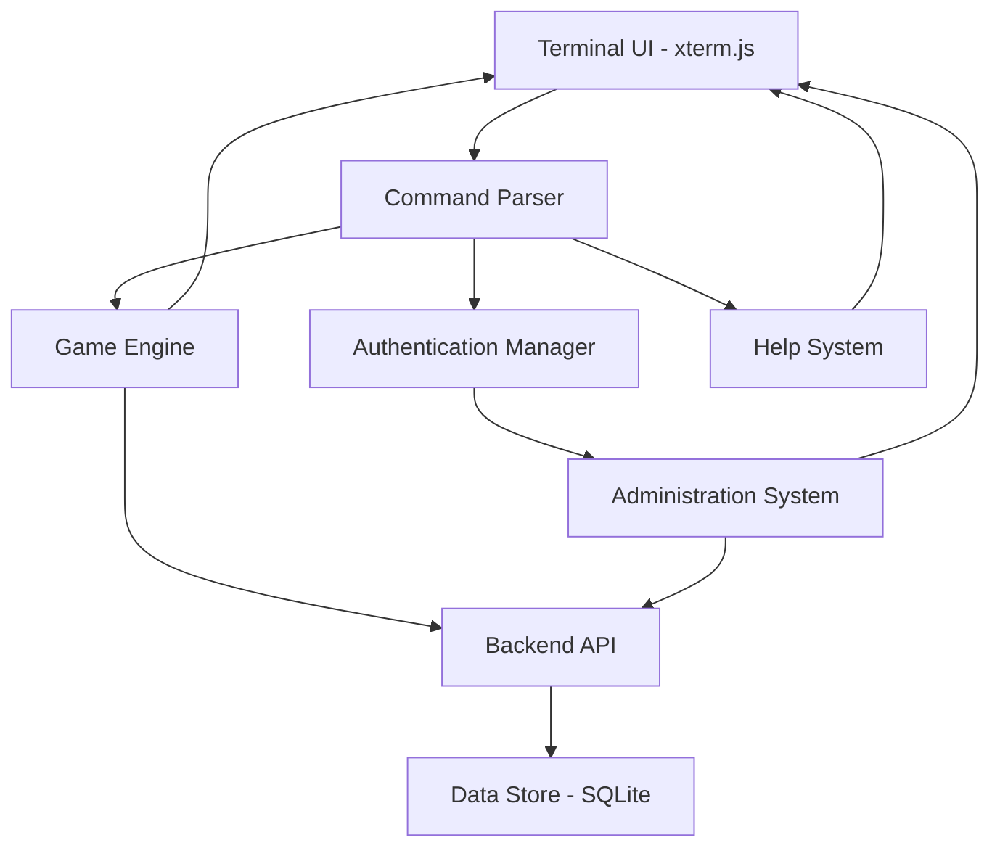

# Design Document

## Overview

The Terminal Adventure Game is a web-based text adventure system built on xterm.js that provides an immersive command-line interface for interactive storytelling. The architecture follows a modular design with clear separation between the terminal interface, game engine, command processing, and data management layers. The system supports both player mode for gameplay and administration mode for adventure creation.

## Architecture

### High-Level Architecture



### Component Layers

1. **Presentation Layer**: xterm.js terminal interface (Frontend)
2. **Command Layer**: Command parser and router (Frontend)
3. **Business Logic Layer**: Game engine and administration system (Frontend)
4. **API Layer**: REST API endpoints (Backend)
5. **Data Layer**: SQLite database with adventure definitions and game state (Backend)

## Components and Interfaces

### 1. Terminal Interface Component

**Responsibilities:**
- Render the xterm.js terminal
- Handle user input and keyboard events
- Display formatted output (text, colors, styles)
- Manage terminal history and scrolling

**Interface:**
```typescript
interface ITerminalInterface {
  initialize(container: HTMLElement): void;
  write(text: string, style?: OutputStyle): void;
  writeLine(text: string, style?: OutputStyle): void;
  clear(): void;
  setPrompt(prompt: string): void;
  onCommand(callback: (command: string) => void): void;
}

enum OutputStyle {
  Normal,
  Success,
  Error,
  Info,
  Dialogue,
  Description,
  System
}
```

### 2. Command Parser Component

**Responsibilities:**
- Parse raw command strings into structured commands
- Validate command syntax
- Route commands to appropriate handlers
- Provide command suggestions for typos

**Interface:**
```typescript
interface ICommandParser {
  parse(input: string): ParsedCommand;
  getAvailableCommands(mode: GameMode): Command[];
  suggestCommand(input: string): string[];
}

interface ParsedCommand {
  command: string;
  args: string[];
  isValid: boolean;
  error?: string;
}

interface Command {
  name: string;
  aliases: string[];
  description: string;
  syntax: string;
  examples: string[];
  handler: CommandHandler;
  mode: GameMode;
}

type CommandHandler = (args: string[], context: GameContext) => CommandResult;
```

### 3. Game Engine Component

**Responsibilities:**
- Manage game state (player location, inventory, flags)
- Execute game commands (move, talk, look, etc.)
- Load and validate adventure definitions
- Handle game logic and state transitions

**Interface:**
```typescript
interface IGameEngine {
  loadAdventure(adventureId: string): Promise<void>;
  executeCommand(command: ParsedCommand): CommandResult;
  getCurrentLocation(): Location;
  getGameState(): GameState;
  resetGame(): void;
}

interface GameState {
  currentLocation: string;
  visitedLocations: Set<string>;
  inventory: Item[];
  flags: Map<string, any>;
  mode: GameMode;
}

interface Location {
  id: string;
  name: string;
  description: string;
  exits: Map<Direction, string>;
  characters: Character[];
  items: Item[];
}

interface Character {
  id: string;
  name: string;
  dialogue: string[];
  currentDialogueIndex: number;
}

enum GameMode {
  Player,
  Admin
}

enum Direction {
  North = 'north',
  South = 'south',
  East = 'east',
  West = 'west',
  Up = 'up',
  Down = 'down'
}
```

### 4. Authentication Manager Component

**Responsibilities:**
- Handle sudo-like authentication
- Manage session privileges
- Validate credentials
- Switch between player and admin modes

**Interface:**
```typescript
interface IAuthenticationManager {
  authenticate(password: string): Promise<boolean>;
  isAuthenticated(): boolean;
  elevatePrivileges(): void;
  dropPrivileges(): void;
  getCurrentMode(): GameMode;
}
```

### 5. Administration System Component

**Responsibilities:**
- Create and edit adventure definitions
- Manage locations, characters, and items
- Validate adventure completeness
- Save and load adventure data

**Interface:**
```typescript
interface IAdministrationSystem {
  createAdventure(name: string): Adventure;
  addLocation(adventureId: string, location: LocationDefinition): void;
  addCharacter(locationId: string, character: CharacterDefinition): void;
  connectLocations(fromId: string, toId: string, direction: Direction): void;
  validateAdventure(adventureId: string): ValidationResult;
  saveAdventure(adventure: Adventure): Promise<void>;
  listAdventures(): Adventure[];
}

interface Adventure {
  id: string;
  name: string;
  description: string;
  startLocationId: string;
  locations: Map<string, Location>;
  createdAt: Date;
  modifiedAt: Date;
}

interface ValidationResult {
  isValid: boolean;
  errors: string[];
  warnings: string[];
}
```

### 6. Help System Component

**Responsibilities:**
- Provide command documentation
- Format help output in man page style
- Support command search and navigation
- Context-aware help based on game mode

**Interface:**
```typescript
interface IHelpSystem {
  getCommandList(mode: GameMode): string;
  getCommandHelp(commandName: string, mode: GameMode): HelpPage;
  searchCommands(query: string): Command[];
}

interface HelpPage {
  name: string;
  synopsis: string;
  description: string;
  options: HelpOption[];
  examples: HelpExample[];
  seeAlso: string[];
}

interface HelpOption {
  flag: string;
  description: string;
}

interface HelpExample {
  command: string;
  description: string;
}
```

### 7. Data Store Component

**Responsibilities:**
- Persist adventure definitions to SQLite database
- Store and retrieve game state
- Handle data serialization and deserialization
- Provide data access layer with SQL queries
- Manage database schema and migrations

**Interface:**
```typescript
interface IDataStore {
  initialize(): Promise<void>;
  saveAdventure(adventure: Adventure): Promise<void>;
  loadAdventure(adventureId: string): Promise<Adventure>;
  listAdventures(): Promise<Adventure[]>;
  deleteAdventure(adventureId: string): Promise<void>;
  saveGameState(state: GameState): Promise<void>;
  loadGameState(): Promise<GameState | null>;
  close(): Promise<void>;
}
```

### 8. Backend API Component

**Responsibilities:**
- Expose REST API endpoints for data operations
- Handle HTTP requests from frontend
- Manage database connections
- Provide authentication endpoints
- Serve static frontend assets

**Interface:**
```typescript
interface IBackendAPI {
  start(port: number): Promise<void>;
  stop(): Promise<void>;
}

// API Endpoints
// GET    /api/adventures          - List all adventures
// GET    /api/adventures/:id      - Get adventure by ID
// POST   /api/adventures          - Create new adventure
// PUT    /api/adventures/:id      - Update adventure
// DELETE /api/adventures/:id      - Delete adventure
// GET    /api/game-state          - Get current game state
// POST   /api/game-state          - Save game state
// POST   /api/auth/login          - Authenticate admin
```

## Data Models

### Database Schema

The SQLite database uses the following schema:

```sql
-- Adventures table
CREATE TABLE adventures (
  id TEXT PRIMARY KEY,
  name TEXT NOT NULL,
  description TEXT,
  start_location_id TEXT NOT NULL,
  created_at DATETIME DEFAULT CURRENT_TIMESTAMP,
  modified_at DATETIME DEFAULT CURRENT_TIMESTAMP
);

-- Locations table
CREATE TABLE locations (
  id TEXT PRIMARY KEY,
  adventure_id TEXT NOT NULL,
  name TEXT NOT NULL,
  description TEXT NOT NULL,
  FOREIGN KEY (adventure_id) REFERENCES adventures(id) ON DELETE CASCADE
);

-- Location connections (exits)
CREATE TABLE location_exits (
  id INTEGER PRIMARY KEY AUTOINCREMENT,
  from_location_id TEXT NOT NULL,
  to_location_id TEXT NOT NULL,
  direction TEXT NOT NULL,
  FOREIGN KEY (from_location_id) REFERENCES locations(id) ON DELETE CASCADE,
  FOREIGN KEY (to_location_id) REFERENCES locations(id) ON DELETE CASCADE,
  UNIQUE(from_location_id, direction)
);

-- Characters table
CREATE TABLE characters (
  id TEXT PRIMARY KEY,
  location_id TEXT NOT NULL,
  name TEXT NOT NULL,
  dialogue TEXT NOT NULL, -- JSON array of dialogue strings
  FOREIGN KEY (location_id) REFERENCES locations(id) ON DELETE CASCADE
);

-- Game state table (single row for current session)
CREATE TABLE game_state (
  id INTEGER PRIMARY KEY CHECK (id = 1),
  current_location TEXT NOT NULL,
  visited_locations TEXT NOT NULL, -- JSON array
  inventory TEXT NOT NULL, -- JSON array
  flags TEXT NOT NULL, -- JSON object
  mode TEXT NOT NULL,
  updated_at DATETIME DEFAULT CURRENT_TIMESTAMP
);

-- Admin credentials table
CREATE TABLE admin_credentials (
  id INTEGER PRIMARY KEY CHECK (id = 1),
  password_hash TEXT NOT NULL,
  salt TEXT NOT NULL
);
```

### Adventure Definition Format (API Response)

Adventures are returned from the API as JSON:

```json
{
  "id": "demo-adventure",
  "name": "The Lost Temple",
  "description": "A demonstration adventure",
  "startLocationId": "entrance",
  "locations": {
    "entrance": {
      "id": "entrance",
      "name": "Temple Entrance",
      "description": "You stand before an ancient temple...",
      "exits": {
        "north": "hall",
        "east": "garden"
      },
      "characters": [
        {
          "id": "guard",
          "name": "Temple Guard",
          "dialogue": [
            "Welcome, traveler. The temple holds many secrets.",
            "Be careful as you explore the halls."
          ]
        }
      ],
      "items": []
    }
  }
}
```

### Game State Format (API Response)

```json
{
  "currentLocation": "entrance",
  "visitedLocations": ["entrance"],
  "inventory": [],
  "flags": {},
  "mode": "player"
}
```

## Command Implementation

### Player Mode Commands

1. **move [direction]** - Move to adjacent location
2. **talk [character]** - Interact with character
3. **look** - Examine current location
4. **help [command]** - Display help information
5. **sudo** - Enter administration mode
6. **exit** - Quit the game

### Administration Mode Commands

1. **create-adventure [name]** - Create new adventure
2. **add-location [name]** - Add location to adventure
3. **add-character [name]** - Add character to location
4. **connect [from] [to] [direction]** - Connect locations
5. **save** - Save current adventure
6. **list-adventures** - Show all adventures
7. **exit** - Return to player mode

## Error Handling

### Error Categories

1. **Command Errors**: Invalid syntax, unknown commands
2. **Game Logic Errors**: Invalid moves, missing characters
3. **Authentication Errors**: Failed login attempts
4. **Data Errors**: Failed save/load operations
5. **Validation Errors**: Incomplete adventure definitions

### Error Handling Strategy

- All errors display user-friendly messages in the terminal
- Command errors suggest correct syntax and available options
- Game logic errors provide contextual information
- System errors are logged but display generic messages to users
- Validation errors list all issues with actionable fixes

### Error Response Format

```typescript
interface CommandResult {
  success: boolean;
  output: string[];
  error?: ErrorInfo;
}

interface ErrorInfo {
  code: string;
  message: string;
  suggestion?: string;
}
```

## Testing Strategy

### Unit Testing
- Test each component in isolation with mocked dependencies
- Focus on command parser logic, game state management, and validation
- Test error handling paths and edge cases
- Verify data serialization and deserialization

### Integration Testing
- Test command flow from parser through engine to output
- Verify authentication and mode switching
- Test adventure creation and loading workflows
- Validate data persistence operations

### End-to-End Testing
- Simulate complete gameplay sessions
- Test administration workflows from creation to save
- Verify help system navigation and content
- Test error recovery scenarios

### Test Data
- Create minimal test adventures with 2-3 locations
- Include edge cases: disconnected locations, missing characters
- Test with various command inputs including malformed commands
- Verify behavior with empty and corrupted data

## Implementation Notes

### Technology Stack

- **Frontend**: TypeScript, xterm.js, Vite
- **Backend**: Node.js with Express
- **Database**: SQLite with better-sqlite3 driver
- **API**: RESTful endpoints with JSON responses
- **Testing**: Vitest for unit and integration tests

### Performance Considerations
- Lazy load adventure data to minimize initial load time
- Cache parsed commands for repeated use
- Limit terminal history to prevent memory issues
- Debounce command input to prevent rapid-fire execution

### Security Considerations
- Sanitize all user input before processing
- Implement rate limiting for authentication attempts
- Validate adventure data before loading to prevent injection
- Use secure password hashing for admin authentication (if persisted)

### Extensibility Points

The design supports future enhancements:
- AI-powered NPCs through pluggable dialogue system
- Multiplayer through shared game state and event system
- Custom command plugins through command registry

